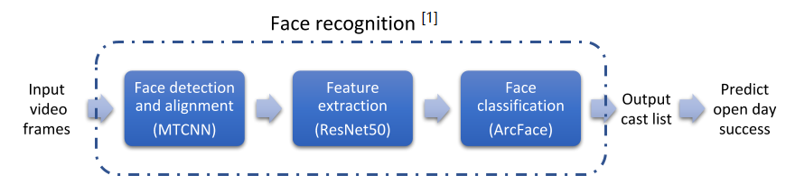
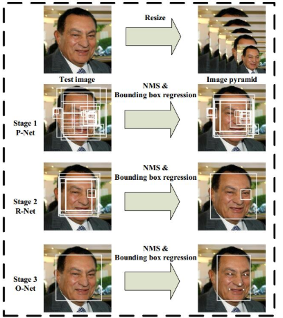
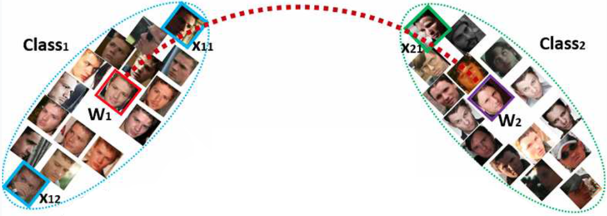
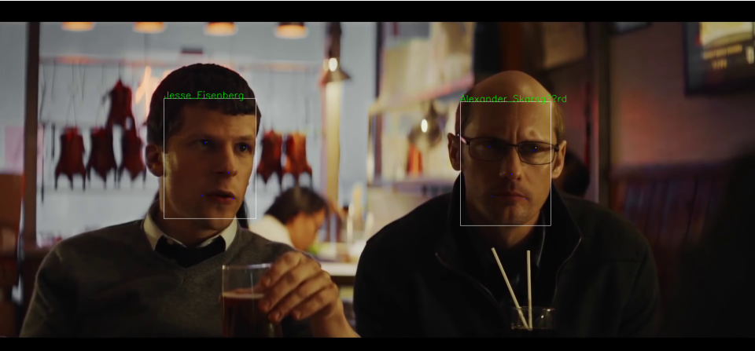

# Predicting opening-weekend box-office revenue

Predicting box-office revenue based on movie trailers and metadata using deep learning. 

## Predictor based on Video Trailer

### Video Model 

    
     

### Face Detection & Alignment 

with Multi-task Cascaded Convolutional Neural Networks (MTCNN) [3]

    
     
    Illustration of MTCNN.

### Feature Extraction

using ResNet-50 [3].

### Face Classification

based on ArcFace [4].

    
     
    Illustration of ArcFace.

### Dataset

The dataset consists of 2000 actors and actresses, which are selected out from the dataset MS-Celeb-1M [5] according their fame.

### Result

    
     

[1] The implementation of face recognition is based on the work of [Zhao, Jian](https://github.com/ZhaoJ9014/face.evoLVe.PyTorch).

[2] He, Kaiming, et al. "Deep residual learning for image recognition." *Proceedings of the IEEE conference on computer vision and pattern recognition*. 2016.

[3] Zhang, Kaipeng, et al. "Joint face detection and alignment using multitask cascaded convolutional networks." *IEEE Signal Processing Letters* 23.10 (2016): 1499-1503.

[4] Deng, Jiankang, et al. "Arcface: Additive angular margin loss for deep face recognition." *Proceedings of the IEEE Conference on Computer Vision and Pattern Recognition*. 2019.

[5] Guo, Yandong, et al. "Ms-celeb-1m: A dataset and benchmark for large-scale face recognition." *European Conference on Computer Vision*. Springer, Cham, 2016.